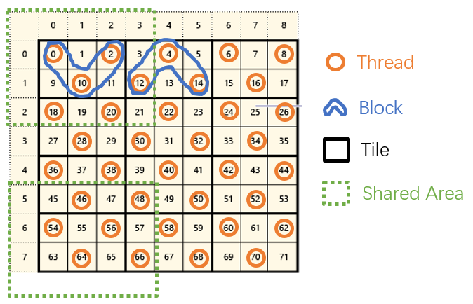

# ACMH

> Q. Xu and W. Tao, “Multi-View Stereo with Asymmetric Checkerboard Propagation and Multi-Hypothesis Joint View Selection,” arXiv:1805.07920 [cs], May 2018.

## Overview of ACMH

I refer to Gipuma(https://github.com/kysucix/gipuma), and implement the ACMH in COLMAP project().

The cuda structure is defined as follows:

* **Grid** The Block container.
* **Block** The Thread container.
* **Thread** The GPU Thread.
* **Tile** The data area that is managed by the Block.
* **Shared Area** The shared area related to a certain tile and its expansion.

The tile_size is defined with both block_size and expansion_size.

The checkerboard algorithm will be implemented in this way.

### Problem Statement

We first introduce the memory structure:

* **GpuMat** The matrix in gpu global memory.
* **RegMat** The matrix in gpu register memory.

We need to calculate these terms:

* **Hypothesis**
  * **Normal Map for RefImage** GpuMat [height,width,1]
  * **Depth Map for RefImage** GpuMat [height,width,1]
* **Cost Map for RefImage** GpuMat [height,width,1]
* **Best View Map for RefImage** GpuMat [height,width,1]
* **Cost Matrix for Each Pixel** RegMat [8,N-1]
* **View Selection Vector for Each Pixel** RegVec [N-1]
* **Cost Weight Vector for Each Pixel** RegVec [N-1]

### Algorithm for GPU implementation

#### Initilization

* Initilize the GPU memory.
* Randomly generate depth map.
* According to the depth map, generate normal map.
* Calculate cost from the random hypothesis.
