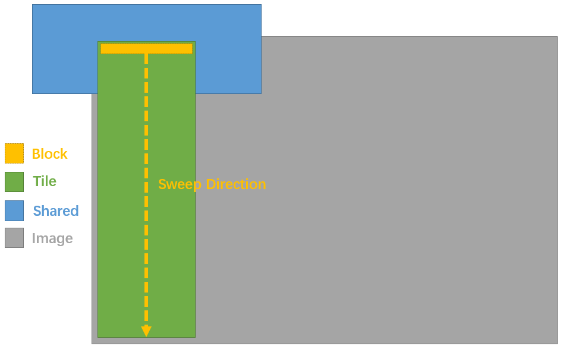

# COLMAP

> J. L. Schönberger, E. Zheng, J.-M. Frahm, and M. Pollefeys, “Pixelwise View Selection for Unstructured Multi-View Stereo,” in Computer Vision – ECCV 2016, vol. 9907, B. Leibe, J. Matas, N. Sebe, and M. Welling, Eds. Cham: Springer International Publishing, 2016, pp. 501–518.

## CUDA Data Structure

* **Block**: Current threads in a cuda-block.
* **Tile**: A subset of image that will be processed by a **Block**.
* **Shared**: A set of cuda-shared-memory by a **Block**.



COLMAP uses a shared tile with fixed memory to store ref image data in a block.

```cpp
// Shared memory holding local patch around current position for one warp.
// Contains 3 vertical stripes of height kWindowSize, that are reused within
// one warp for NCC computation. Note that this limits the maximum window
// size to 2 * THREADS_PER_BLOCK + 1.
__shared__ float local_ref_image[THREADS_PER_BLOCK * 3 * kWindowSize];
```

That is,in colmap, it defines:

```cpp
#define SHARED_WIDTH (3*THREADS_PER_BLOCK)
#define SHARED_HEIGHT (kWindowSize)
```

## Sweeping
In each iteration, COLMAP only read a line of shared data from texture memory, the other data is translated by one line.
