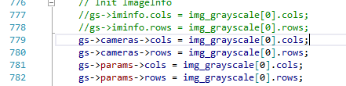

# Fusibile

> [S. Galliani, K. Lasinger, and K. Schindler, “Massively Parallel Multiview Stereopsis by Surface Normal Diffusion,” in 2015 IEEE International Conference on Computer Vision (ICCV), Santiago, Chile, 2015, pp. 873–881.

Fusibile read all the images in one folder, and fuse all of them in to a global point cloud.

Fusibile use the first image as Reference Image.

From colmap, there is an existing view-graph, fusibile should be able to use it.

## View Selection

## Bugs

* Fusibile only uses one image size (image[0].size), the undistorted images from colmap have different sizes. We yet do not know the influence for the fusion.

